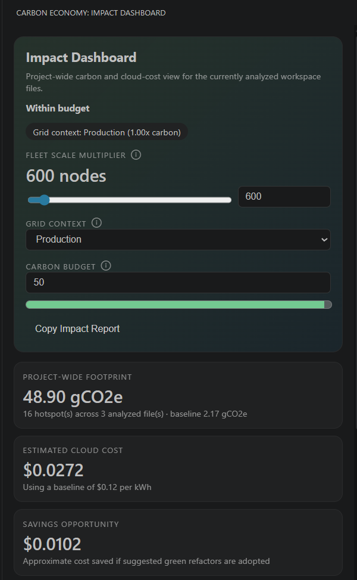
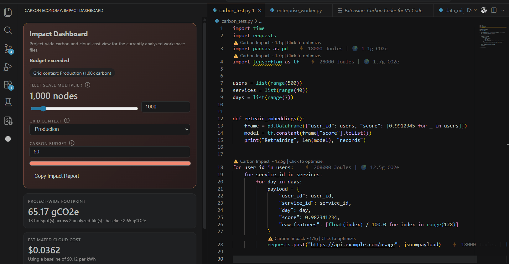
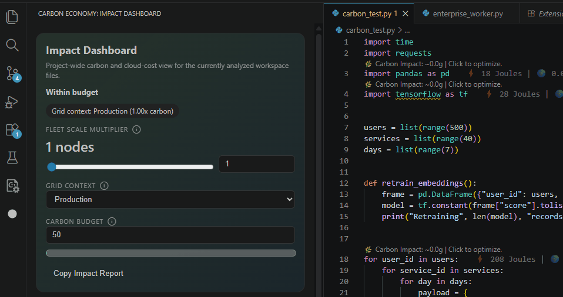
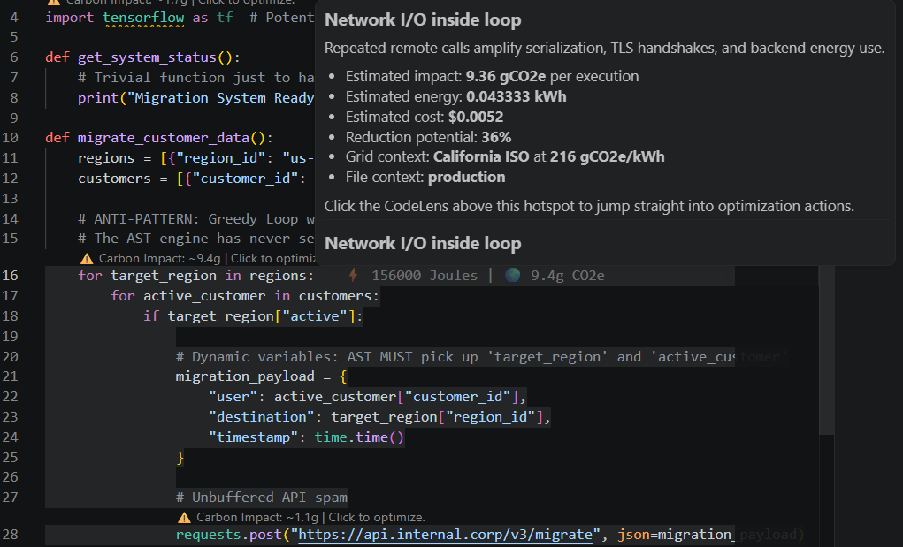
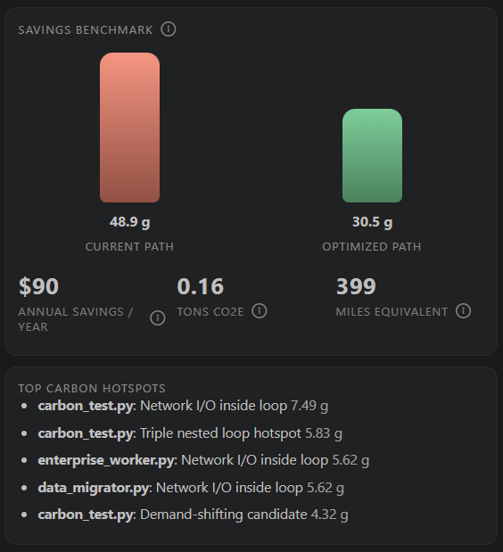

# Carbon Coder

Analyze, budget, and refactor your code's carbon footprint at fleet scale with intelligent, variable-aware quick fixes.

Carbon Coder is a VS Code extension for Green Software Engineering. It helps developers identify energy hotspots, estimate carbon impact with grid-aware heuristics, and apply practical refactors that scale from a single script to a cloud fleet.



## Why Carbon Coder

Most developer tooling stops at performance. Carbon Coder pushes one step further into energy efficiency, infrastructure cost, and carbon-aware engineering decisions.

It is built for teams shipping:

- SaaS backends and cloud workers
- Enterprise data pipelines and migrations
- Mobile and edge workloads where battery and network energy matter
- High-scale internal tools that run across hundreds or thousands of nodes

## Why It Stands Out

Carbon Coder is designed to make sustainability visible inside the developer workflow, not in a separate dashboard after the damage is done.

It combines:

- Carbon-aware CodeLens above hotspots
- Inline carbon context in the editor
- A project-wide Impact Dashboard with budgeting and fleet scaling
- Actionable quick fixes for greener code, not just warnings
- Scale-aware math so tiny inefficiencies feel real in cloud and enterprise environments

## See It In Action

### Quick Fixes



### Fleet-Scale Modeling



## What It Detects

- Deep loops such as `O(n^2)` and `O(n^3)` patterns
- Unbuffered network I/O inside bounded loops
- Zombie polling loops that keep compute and network awake
- Heavy imports that increase startup and memory overhead
- Demand-shifting opportunities for expensive jobs
- Payload reduction opportunities for network-heavy code

## What It Helps You Do

- Replace `requests.post(...)` inside a loop with streamed chunked batching
- Add backoff to a `while True` polling worker
- Swap expensive import patterns for lighter alternatives
- Show how a tiny per-run inefficiency becomes significant at `10,000` nodes

## Product Experience

- CodeLens: carbon impact shown directly above hotspots
- Hover cards: educational explanations that connect code patterns to real-world impact
- Metadata hints: lightweight Joules and CO2e context at the edge of the editor
- Impact Dashboard: modeled footprint, carbon budget, benchmark view, and fleet multiplier controls
- Status bar: quick project carbon score in `gCO2e/run`

### Hover Intelligence



### Savings Story



## Green Refactors

Carbon Coder does more than point out problems. It suggests sustainable next steps that are relevant to the code in front of you.

- Batching for repetitive network calls
- Backoff for wasteful polling loops
- Import slimming for heavy dependency usage
- Demand shifting for expensive work that can move into cleaner grid windows
- Payload reduction for network-heavy paths

## Built For Scale

Saving a tiny amount of energy on one machine is easy to ignore. Carbon Coder turns that into fleet math so teams can reason in terms of:

- `gCO2e` per execution
- annualized infrastructure savings
- thousands of nodes instead of one laptop
- real tradeoffs between developer convenience and operational impact

## Demo Files

The repo includes realistic workloads that make the extension easy to demo:

- `carbon_test.py`
- `enterprise_worker.py`
- `data_migrator.py`

These sample files are intentionally written with cloud-scale inefficiencies so the analyzer, dashboard, and quick fixes are easy to see in action.

## Architecture

```text
src/
  analyzer.ts               AST + heuristic hotspot detection
  carbon.ts                 Energy-to-carbon conversion logic
  electricityMapsMock.ts    Mock carbon-intensity service and low-carbon windows
  extension.ts              VS Code UI wiring, dashboard, CodeLens, and status bar
  greenFixes.ts             Quick Fix recipes and code actions
  types.ts                  Shared types and analysis contracts
media/
  hot-low.svg               Activity and editor visual assets
  hot-medium.svg
  hot-high.svg
```

## Notes

The cost and carbon model is intentionally heuristic so the extension stays fast and explanatory inside the editor. The goal is not perfect hardware telemetry. The goal is to make sustainable engineering decisions visible, actionable, and meaningful at scale.
